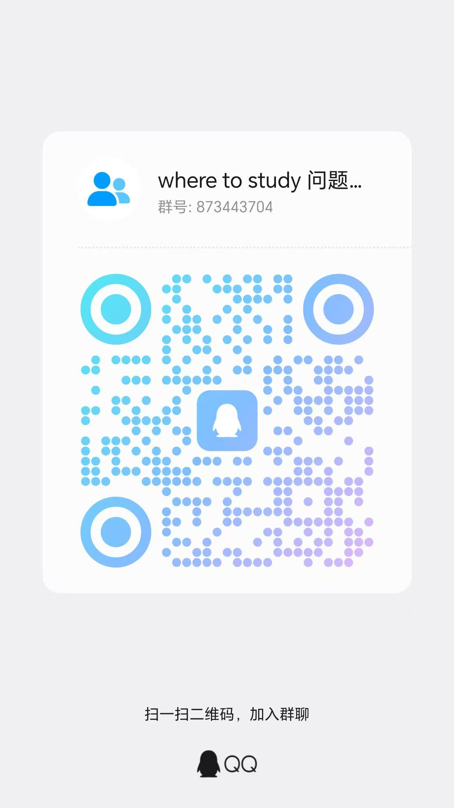

# Where To Study

北邮空教室、个人课表与教学日历应用。公开的班车和活动信息无需登录；查询个人课表、空教室、成绩、考试与课程作业时需要学校账号。项目开源、无盈利性质，并非学校官方应用。

## 下载与安装

最新正式版是 [Where To Study v0.3.1](https://github.com/Nemoyuzx/where_to_study/releases/tag/v0.3.1)。GitHub 提供 Windows、Linux、macOS 和 Android 安装包；iOS/macOS 的 0.3.1 (99) 已上传 TestFlight，鸿蒙 0.3.1 (1002035) 已上传 AppGallery 测试渠道。应用商店展示的版本可能与 GitHub 不同。

| 设备 | 下载或测试渠道 | 安装方式 |
| --- | --- | --- |
| Windows x64 | [安装程序](https://github.com/Nemoyuzx/where_to_study/releases/download/v0.3.1/Where-To-Study-v0.3.1-windows-x64-setup.exe) | 双击安装；支持 Intel/AMD 64 位电脑。 |
| macOS 13+ | [Universal DMG](https://github.com/Nemoyuzx/where_to_study/releases/download/v0.3.1/Where-To-Study-v0.3.1-native-macos-universal.dmg) | 打开 DMG，将应用拖入「应用程序」；兼容 Apple 芯片与 Intel。 |
| Android | [Universal APK](https://github.com/Nemoyuzx/where_to_study/releases/download/v0.3.1/Where-To-Study-v0.3.1-native-android-universal.apk) | 在设备上打开 APK，按系统提示安装。 |
| Ubuntu/Debian Linux | [x86_64 DEB](https://github.com/Nemoyuzx/where_to_study/releases/download/v0.3.1/Where-To-Study-v0.3.1-linux-x86_64.deb) · [aarch64 DEB](https://github.com/Nemoyuzx/where_to_study/releases/download/v0.3.1/Where-To-Study-v0.3.1-linux-aarch64.deb) | 按处理器架构选择，用系统软件安装器打开。 |
| 其他 Linux | [x86_64 AppImage](https://github.com/Nemoyuzx/where_to_study/releases/download/v0.3.1/Where-To-Study-v0.3.1-linux-x86_64.AppImage) · [aarch64 AppImage](https://github.com/Nemoyuzx/where_to_study/releases/download/v0.3.1/Where-To-Study-v0.3.1-linux-aarch64.AppImage) | 允许文件「作为程序执行」后打开。 |
| iPhone/iPad（iOS/iPadOS 16+） | [TestFlight 公测邀请](https://testflight.apple.com/join/yuzpAtDJ) | 先安装 TestFlight；可安装版本以 Apple 页面为准。 |
| HarmonyOS NEXT | AppGallery 测试渠道 | 能否加入测试及安装，以华为测试邀请页面为准；当前未提交正式商店审核。 |

后续版本请查看[最新正式版页面](https://github.com/Nemoyuzx/where_to_study/releases/latest)。

Linux 的 `x86_64` 对应普通 Intel/AMD 64 位电脑，`aarch64` 对应 ARM 64 位设备。Release 中的 `Source code` 是源码，不能用来安装应用；`cli`/`tui` 压缩包是 Linux 终端工具，见 [CLI](./wts-cli/README.md) 和 [TUI](./wts-tui/README.md) 说明。GitHub 不提供 iOS、鸿蒙安装包或 Android AAB。Android 也可关注 vivo 与华为应用商店，具体版本以商店页面为准。

需要 Apple 内测名额的同学，可将 iCloud 邮箱发至 [2099905168@qq.com](mailto:2099905168@qq.com)，由作者添加。Windows 安装包尚无公众信任的代码签名，macOS GitHub DMG 尚未经过 Apple 公证；遇到系统安全提示时请阅读[下载文件验证说明](./docs/code-signing.md)。

### v0.3.1 更新

- Android 查询页切换时保留标题、选项栏和各页滚动位置；后台课表更新不再使整个查询页刷新。
- Android 考试与作业查询的分组间距更统一；窄屏查询选项改用图标，并保留中英文无障碍名称。
- 各图形平台的成绩卡片和平均绩点区域更紧凑；Android 修复空成绩间距、当前学期标记、主题切换后成绩消失，以及班车刷新图标偏斜等问题。

完整改动见 [v0.3.1 Release 说明](https://github.com/Nemoyuzx/where_to_study/releases/tag/v0.3.1)，安装包摘要与渠道状态见[正式版发布记录](./docs/release-v0.3.1.md)。

## 主要功能

- **课表与空教室：** 个人课表通过移动教务 HTTPS 接口获取并缓存；空教室一次查询西土城与沙河两个校区，可按教学楼和个人空闲节次筛选。课程可仅在本地删除某次排课或本学期整门课，并在设置中恢复；不会向学校退课。[课程管理说明](./docs/course-management-v0.2.9.md)
- **教学日历：** 日、周、月、年视图展示课程、期末考试和各类 DDL；公历周与教学周并列显示，Apple、Android 和鸿蒙客户端支持导入设备系统日历。月视图日期详情包含课程、云课堂作业、黄历宜忌与活动截止信息。日程可收藏为本地快照，也可接入符合[自定义日程接口规范](./docs/custom-schedule-api.md)的公开 HTTPS JSON 地址。
- **信息查询：** 独立查询页提供班车、重要事件、成绩、考试和课程作业。班车与重要事件属于公开信息；个人成绩、考试和作业使用学校账号。教学云密码可与教务密码分开保存，未单独设置时使用教务密码。[成绩与考试说明](./docs/academic-query-contract.md)
- **提醒与小组件：** 每日课程摘要默认提醒时间为北京时间 07:30；课前提醒默认提前 10 分钟，可自定义 1–5 次。两类提醒都默认关闭。iOS、macOS、Android 小组件与鸿蒙服务卡片优先显示今日课程，有空间时补充明日课程；Windows/Linux 提供运行时通知，不提供课程小组件。[课前提醒与平台限制](./docs/pre-class-reminders.md)
- **外观与语言：** 图形客户端支持简体中文和 English，以及多套预设和自定义颜色主题；第三方接口返回的课程、天气、黄历和活动文字保持原文。[主题说明](./docs/color-themes.md)

法定节假日、天气、黄历与活动日程来自下述公开数据源。页面展示的数据仅供参考，请以学校和活动主办方的实际通知为准。完整隐私声明见 [Privacy Policy / 隐私政策](./PRIVACY.md)。

## 课程提醒与桌面小组件

每日课程摘要和课前提醒是独立开关，默认均关闭。摘要时间可自定义，默认北京时间 07:30；课前提醒默认提前 10 分钟，可设置 1–5 次。有明确开始时间的考试也可参与课前提醒；删除课程、刷新课表或切换账号后会按新的本地日程重排，已过期提醒不补发。

Android 可选择授权系统“闹钟和提醒”以尽量准时，未授权时可能受后台调度延迟。Apple 与鸿蒙受系统待排数量限制，需适时重新打开应用补排；Windows/Linux 只有在应用运行或驻留托盘时才能投递通知。平台规则见[课前提醒说明](./docs/pre-class-reminders.md)和[每日提醒说明](./docs/reminder-time-and-tomorrow-widget.md)。

iOS/macOS 的 WidgetKit 小组件、Android 桌面小组件和鸿蒙服务卡片只读取本地课表缓存，不额外请求网络；优先显示今日课程，有空间时再显示明日课程。Windows/Linux 不提供课程小组件。

## 数据来源与数据安全

### 个人账户与本地数据

班车、活动等公开信息无需学校账号；个人课表、空教室、成绩、考试和作业查询需要学号与密码。图形客户端不会将密码写入普通设置文件：Windows 使用 Credential Manager，macOS/iOS 使用 Keychain，Linux 图形端使用 Secret Service，Android 使用 Android Keystore，鸿蒙使用系统 Asset Store。课程和空教室缓存不包含密码、令牌或 Cookie；成绩结果只在当前进程内短期保留。旧版 Tauri `settings.json` 的凭据会迁移到系统安全存储；完整设计与限制见[安全说明](./docs/security.md)。

`where-to-study-cli` 与 `where-to-study-tui` 按终端客户端的独立约定，不调用系统密码库：
账号和密码分别保存在用户配置目录下权限受限的专用本地文件中，且不会自动读取或迁移
图形客户端的系统凭据。具体路径与风险说明见 [wts-cli/README.md](./wts-cli/README.md)
和 [wts-tui/README.md](./wts-tui/README.md)。

### 节假日、天气与活动

法定节假日运行时数据来自
[cg-zhou/holiday-calendar](https://github.com/cg-zhou/holiday-calendar)，客户端通过其文档列出的
[固定到 1.3.3 版本的 unpkg HTTPS 年度 JSON 地址](https://unpkg.com/holiday-calendar@1.3.3/data/CN/2026.json)按年份读取 `CN`
数据。上游说明中国数据依据国务院办公厅年度节假日安排通知整理，并以 MIT License 发布；完整版权与
许可文本见 [THIRD_PARTY_NOTICES.md](./THIRD_PARTY_NOTICES.md)。客户端严格核对响应年份、地区、日期、
名称和类型，将 `public_holiday` 与 `transfer_workday` 映射到现有本地契约，未知类型不会写入缓存。
Tauri、SwiftUI 和 Android 客户端都保留一份仅用于首次离线展示的 2026 年兜底日期，其内容对应
[国务院办公厅关于 2026 年部分节假日安排的通知](https://www.gov.cn/yaowen/liebiao/202511/content_7047099.htm)；
远端或本地缓存可用后会使用自动获取的数据。

Android 原生客户端在用户已授权系统日历访问时，可从设备自带的“中国（大陆）节假日”日历读取休息日，并仍以远端数据补充“调休/补班”上班日。iOS/macOS 设备日历会混入不等于休息日的普通节日，因此 Apple 客户端与 Tauri 桌面端都只使用上述固定版本权威数据源标记“休/班”。

校区天气和基础黄历信息来自 [UAPI 天气接口](https://uapis.cn/docs/api-reference/get-misc-weather)与[农历接口](https://uapis.cn/docs/api-reference/get-misc-lunartime)，黄历中的“宜/忌”由 [Timeless API](https://api.timelessq.com/docs/api-15277838)补充。西土城按海淀区行政区划代码查询，沙河按昌平区查询；黄历请求只提交所选日期或由其换算的时间戳和上海时区，不会附带教务凭据、课表或空教室数据。Windows、Linux、iOS、macOS、Android 与 HarmonyOS 图形客户端的天气区域统一为默认折叠卡片，折叠时保留校区与当前天气摘要，展开后显示今日、明日详情和数据来源；设置中可以完全关闭天气或黄历卡片。

学科竞赛、学术会议、期刊专题、夏令营、预推免与黑客松 DDL 的主数据来自 [Contest DDL](https://nemoyuzx.github.io/contest-ddl/) 的[公开 JSON](https://nemoyuzx.github.io/contest-ddl/data/competitions.json)，应用下载后仅在本地按所选日期和已开启类别筛选。主源不可用时，支持的平台会尝试固定 HTTPS 备用地址 [`https://where-to-study.cn/api/contest-events`](https://where-to-study.cn/api/contest-events)。独立的[北邮校内竞赛通知 API](https://where-to-study.cn/api/contest-notices)由服务器脚本从学校内部网站的公开通知页提取并整理截止节点，条目链接回云课堂 HTTPS 原文。两条固定接口都只发送不含账号、密码、Cookie、token、课表、教室或作业数据的 HTTPS GET，并拒绝重定向。学科竞赛、学术会议、校内竞赛通知、夏令营和黑客松各有独立的教学日历开关，卡片底部会标明全部第三方来源。

### 班车、自定义日程与课程作业

校区班车来自固定的[班车 API](https://where-to-study.cn/api/shuttle-bus)。服务器每小时增量检查北京邮电大学后勤部公开通知，只把通过严格校验的官方表格识别结果作为结构化班次；客户端按上海日期选择当前执行时段和当天星期，并标记已发车、下一班与计划班次。最新通知尚未安全解析时只会明确显示提示或上一份完整表作为对照，不会发布推测班次。请求不包含教务凭据、课表、校区设置或 GPS，节假日及临时调整请以后勤部原文为准。

用户还可以启用[自定义日程接口](./docs/custom-schedule-api.md)。客户端只接受不含凭据、片段、回环地址或私网字面量的公开 HTTPS JSON 地址，拒绝重定向并限制响应大小、条目数与查询频率；API 返回的文字保持原文。收藏操作会把单条日程的完整快照保存在当前设备，不上传也不跨设备同步；来源关闭、失败或移除条目后仍会在教学日历中显示，取消收藏或“清除本地数据”才会删除。

课程作业解析以[北邮云课堂官方作业页](https://ucloud.bupt.edu.cn/uclass/course.html#/student/studentAssignmentListPage?ind=3)的真实 `records` / `undoneList` 响应契约为准。查询作业或打开日期详情中的作业卡时，图形客户端从系统安全存储临时读取已保存的学号和教学云平台密码；未单独设置云密码时使用教务密码。仅通过 HTTPS 提交给 `auth.bupt.edu.cn` 完成统一认证，再以内存中的一次性票据换取云课堂访问令牌并读取当前课程和作业；不会读取浏览器 Cookie/token，也不会把密码发送给 `ucloud.bupt.edu.cn` 或 `apiucloud.bupt.edu.cn`。票据、Cookie 和令牌不写入磁盘；用于跨日期查询的全量作业结果最多复用 10 分钟，已显示的日期结果只保留在当前进程内，并在凭据改变、切换账号或清除本地数据时失效。旧凭据发起的请求不能覆盖新凭据的数据。

## 反馈与交流群

发现问题或有功能建议，可以提交 [GitHub Issue](https://github.com/Nemoyuzx/where_to_study/issues)，也可以加入 QQ 交流群获取更新信息。请勿在公开 Issue 或群聊中发送学号、密码、令牌或个人课表；安全问题请按 [Security Policy](./SECURITY.md) 中的流程报告。

<table>
  <tr><th align="center">QQ 交流群</th></tr>
  <tr><td align="center">群号：<code>873443704</code></td></tr>
  <tr><td align="center"></td></tr>
</table>

北邮校内的其他非官方学生组织也可以联系作者洽谈网站友链。喜欢这个项目，欢迎给仓库点 Star；若想支持建站和 Apple 开发者账户费用，可通过[爱发电](https://ifdian.net/a/Nemoyuzx)赞助。

## 鸣谢 / Acknowledgements

感谢以下开源项目公开接口资料与相关实现，为教务查询接入和交叉核验提供参考：

- [Yokumii/bupt-api-collected](https://github.com/Yokumii/bupt-api-collected)：微教学与教学云接口资料，包括成绩和考试安排。
- [heimaolala/open-empty-classroom](https://github.com/heimaolala/open-empty-classroom)：空教室查询相关开放实现。
- [Jraaay/EmptyClassroom](https://github.com/Jraaay/EmptyClassroom)：空教室查询相关实现与参考。

Where To Study 不会将学生凭据或成绩发送给这些参考项目或其代理服务；各项目的许可证归其作者所有。

## 许可证

本项目按 [GNU General Public License v3.0 only](./LICENSE)（SPDX：`GPL-3.0-only`）开源发布。分发本项目或其衍生版本时须遵守该许可证；第三方材料分别遵循 [`THIRD_PARTY_NOTICES.md`](./THIRD_PARTY_NOTICES.md) 与 [`THIRD_PARTY_LICENSES.html`](./THIRD_PARTY_LICENSES.html) 中记录的条款。

## 开发与运行

Windows/Linux 图形端使用 Tauri 2、React 和 Rust；macOS/iOS 使用 SwiftUI；Android 使用 Kotlin 与 Android Views；HarmonyOS NEXT 使用 ArkTS 与 ArkUI。仓库还保留 macOS 的 Tauri Apple Silicon 兼容构建。贡献前请阅读 [CONTRIBUTING.md](./CONTRIBUTING.md) 和[平台路线图](./docs/platform-roadmap.md)。

所有平台的应用主图标以 `src-tauri/icons/icon.png`（Windows/Tauri 当前绿色日历课桌图标）为唯一源图。修改源图后运行 `npm run icons:sync`，同步生成 Windows/macOS Tauri、原生 iOS 和 Android 启动图标；macOS 菜单栏与 Android 通知图标仍使用符合系统规范的单色模板资源。

```bash
npm install
npm run tauri dev
```

### 构建桌面端

```bash
npm run tauri:build
```

在 Windows 机器上构建可复现的 64 位 NSIS 安装包：

```bash
npm run tauri:build:windows
```

该脚本固定使用 `--bundles nsis --ci`，产物位于 `src-tauri/target/x86_64-pc-windows-msvc/release/bundle/nsis/`。Windows 构建建议在 Windows 机器或 Windows CI runner 上执行，需要安装 Rust MSVC toolchain、Microsoft C++ Build Tools 和 WebView2 Runtime。

在 Debian 12/Ubuntu 22.04 或兼容的 x86_64 Linux 环境构建 Debian 包与 AppImage：

```bash
npm run tauri:build:linux
./scripts/linux-package.sh vX.Y.Z
```

Linux 打包脚本会解包校验版本、架构、Tauri 按构建环境检测出的 GTK/WebKitGTK/托盘运行时依赖、正式 HTTPS 数据源和三份法律文件，并输出带相邻 SHA-256 文件的 `.deb` 与 `.AppImage`。仓库的 `Build Linux` 工作流使用 Ubuntu 22.04 作为兼容构建基线，并在 Ubuntu 24.04 runner 上实际安装生成的 `.deb`。

Linux 终端客户端可以直接从 Release 安装。以 x86_64 为例：

```bash
mkdir -p ~/.local/bin
curl -fL https://github.com/Nemoyuzx/where_to_study/releases/latest/download/where-to-study-cli-linux-x86_64.tar.gz | tar -xz
curl -fL https://github.com/Nemoyuzx/where_to_study/releases/latest/download/where-to-study-tui-linux-x86_64.tar.gz | tar -xz
install -m 0755 where-to-study-cli where-to-study-tui ~/.local/bin/
```

arm64 Linux 将文件名中的 `x86_64` 改为 `aarch64`。也可以按 CLI/TUI 各自 README
中的步骤从源码构建；请确保 `~/.local/bin` 已加入 `PATH`。

### 原生客户端

生成并验证 macOS/iOS SwiftUI 工程：

```bash
./scripts/native-apple-build.sh
```

验证 Android Kotlin 工程：

```bash
./scripts/native-android-build.sh
```

验证鸿蒙（HarmonyOS NEXT）ArkTS 工程（需要 DevEco Studio 6.1.1+ 与已连接的设备/模拟器）：

```bash
./scripts/native-harmony-build.sh
```

`native/apple`、`native/android` 与 `native/harmony` 分别是当前 Apple、Android 和鸿蒙客户端源码。Apple 客户端另有不连接教务服务的内置示例模式，可用于首次体验。鸿蒙 0.3.1 已通过 AppGallery 测试渠道云测试；这不代表正式商店审核或上架。

Android 仅使用 `native/android` 的 Kotlin + Android Framework Views 工程，不依赖 Tauri 或 WebView。旧 `src-tauri/gen/android` 工程、Tauri Android npm 命令和 CI 构建任务均已移除，避免误生成或误发布另一套 Android 包。

生成本地签名 Android APK/AAB、macOS Universal ZIP/DMG 和无签名 iOS 真机 archive：

```bash
./scripts/native-android-signing-init.sh
./scripts/native-android-package.sh vX.Y.Z
./scripts/native-macos-package.sh vX.Y.Z
./scripts/native-ios-package.sh vX.Y.Z
```

Android 脚本会运行 Release 单元测试与 Lint，构建并校验签名 APK 与 AAB；macOS 脚本构建双架构 Release 应用、进行临时签名和签名校验，并生成带 Applications 快捷方式且通过 `hdiutil verify` 的 DMG；iOS 脚本构建 arm64 真机 archive，并检查应用图标和隐私清单。三个脚本都会在 `release-artifacts/` 中生成产物和 SHA-256 文件。Android 脚本需要本地、已忽略的 release keystore；macOS GitHub 包不包含 Developer ID 公证票据；iOS archive 未签名，不能直接安装到 iPhone。发布前还应另外运行完整测试和所需的人工运行检查。

面向 Mac App Store、iOS App Store 或 TestFlight 的正式签名归档使用：

```bash
./scripts/native-apple-app-store.sh preflight all
APPLE_DEVELOPMENT_TEAM=XXXXXXXXXX APPLE_BUILD_NUMBER=100 \
  ./scripts/native-apple-app-store.sh archive all
```

示例中的团队 ID 和构建号需替换为实际值，构建号应递增。脚本还支持 `export` 与 `upload` 动作，并可单独指定 `ios` 或 `macos`。本地正式构建使用已安装的 Apple Distribution、Mac Installer Distribution 证书及 iOS/macOS 主应用和 Widget 共四个 App Store 描述文件；团队、描述文件覆盖值和 App Store Connect API 私钥只通过环境变量传入。完整账户配置与审核步骤见 [`native/apple/AppStore/submission-checklist.md`](./native/apple/AppStore/submission-checklist.md)。

## GitHub Actions

仓库内提供以下构建和安全工作流：

- `.github/workflows/build-windows.yml`：在 `windows-latest` 上构建 Windows 桌面安装包。
- `.github/workflows/build-linux.yml`：在 Ubuntu x86_64/arm64 runner 上构建、安装验证 Linux Debian/AppImage，并为标签制品生成来源证明。
- `.github/workflows/build-cli.yml` 与 `.github/workflows/build-tui.yml`：构建两个架构的 Linux 终端制品，并为标签制品生成来源证明。
- `.github/workflows/build-macos.yml`：在 `macos-15` 上构建并压缩 macOS Apple Silicon 应用。
- `.github/workflows/build-native.yml`：在主分支及手动触发时运行 Rust/Apple 测试，在主分支运行 Android Debug 门禁；版本标签额外生成 SwiftUI macOS Universal、无签名 iOS archive，以及签名 Android APK/AAB，但公开 GitHub Release 只接收 APK，AAB 保留给商店/内部交付。
- `.github/workflows/security.yml`：扫描提交历史中的敏感信息，并审计完整 npm 与 Rust 锁文件依赖。

正式原生 Android 标签构建使用以下 secrets：`ANDROID_RELEASE_KEYSTORE_BASE64`、`ANDROID_RELEASE_STORE_PASSWORD`、`ANDROID_RELEASE_KEY_ALIAS`、`ANDROID_RELEASE_KEY_PASSWORD`。标签工作流生成的未签名 iOS archive 与 macOS 构建仅作为受限的 Actions artifact 用于内部验证，不上传到公开 GitHub Release；App Store 构建使用本地、Xcode Cloud 或受保护 CI 环境中的 Apple 分发凭据，不把证书或私钥提交到仓库。

Windows/Linux 标签构建使用 GitHub OIDC 短期身份生成来源证明，不保存 Sigstore 私钥。Windows 的 Authenticode“已验证发布者”必须另行完成公众信任身份验证；不要用自签名证书或把新购证书假定为可导出的 PFX。完整配置边界见 [docs/code-signing.md](./docs/code-signing.md)。

如果不在界面输入学号和教务密码，也可以在启动前配置环境变量：

```bash
export BUPT_USERNAME=你的学号
export BUPT_PASSWORD=你的教务密码
```

学期号与开学日期的持久化默认值保持为空；自动模式会在请求课表时按上海时区的
当前日期生成临时兜底值，手动模式则要求用户完整填写。

学期与开学日期支持自动识别：

- 设置页提供「按当前日期自动检测」按钮，按校历规律（春季 3 月初 / 秋季 9 月初）
  预填当前学期的学期号与开学日期。
- 教务当前周课表返回的学期号、周次和日期为权威信息；客户端由此反推第一周周一并保存。
- 保存有效教务凭据且开启自动检测后，应用启动时会自动刷新一次个人课表以校验学期；
  教务暂时缺少该元数据时，才使用当前日期推断作为临时兜底。
